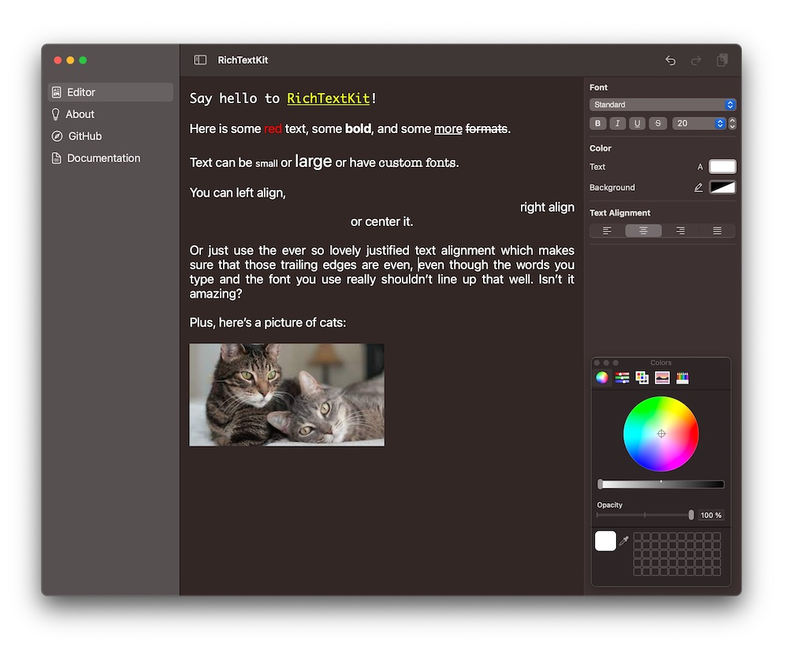

<p align="center">
    
</p>

<p align="center">
    
    
    
    <a href="https://twitter.com/danielsaidi"></a>
    <a href="https://mastodon.social/@danielsaidi"></a>
</p>


## About RichTextKit

RichTextKit helps you view and edit rich text in `SwiftUI`, `UIKit` and `AppKit`.

RichTextKit has a multi-platform SwiftUI `RichTextEditor` that can be added to any app:

<p align="center">
    
</p>

The `RichTextEditor` supports text styles (bold, italic, underline, etc.), fonts and font sizes, colors, text alignments, image attachments, etc.

The `RichTextEditor` is powered by a UIKit/AppKit `RichTextView` that bridges the UIKit `UITextView` and AppKit `NSTextView` and adds APIs to make the view work similar on both platforms.


## Installation

RichTextKit can be installed with the Swift Package Manager:

```
https://github.com/danielsaidi/RichTextKit.git
```

If you prefer to not have external dependencies, you can also just copy the source code into your app.


## Getting started

RichTextKit has a SwiftUI ``RichTextEditor`` that takes a text binding and a ``RichTextContext``:

```swift
struct MyView: View {

    @State
    private var text = NSAttributedString(string: "Type here...")
    
    @StateObject
    var context = RichTextContext()

    var body: some View {
        RichTextEditor(text: $text, context: context) {
            // You can customize the native text view here
        }
    }
}
```

The editor uses a ``RichTextCoordinator`` to sync changes between the editor, context, and platform-specific view. You can use the context to change font, colors, alignment etc. and observe context changes to update the UI.

For more information, please see the [getting started guide][Getting-Started].


## Documentation

The [online documentation][Documentation] has more information, articles, code examples, etc.


## Demo Application

The demo app lets you explore the library on iOS and macOS. To try it out, just open and run the `Demo` project.


## Support my work

You can [sponsor me][Sponsors] on GitHub Sponsors or [reach out][Email] for paid support, to help support my [open-source projects][GitHub].


## Contact

Feel free to reach out if you have questions or want to contribute in any way:

* Website: [danielsaidi.com][Website]
* Mastodon: [@danielsaidi@mastodon.social][Mastodon]
* Twitter: [@danielsaidi][Twitter]
* E-mail: [daniel.saidi@gmail.com][Email]


## License

RichTextKit is available under the MIT license. See the [LICENSE][License] file for more info.


[Email]: mailto:daniel.saidi@gmail.com
[Website]: https://www.danielsaidi.com
[GitHub]: https://www.github.com/danielsaidi
[Twitter]: https://www.twitter.com/danielsaidi
[Mastodon]: https://mastodon.social/@danielsaidi
[Sponsors]: https://github.com/sponsors/danielsaidi

[Documentation]: https://danielsaidi.github.io/RichTextKit/documentation/richtextkit/
[Getting-Started]: https://danielsaidi.github.io/RichTextKit/documentation/richtextkit/getting-started
[License]: https://github.com/danielsaidi/RichTextKit/blob/master/LICENSE
