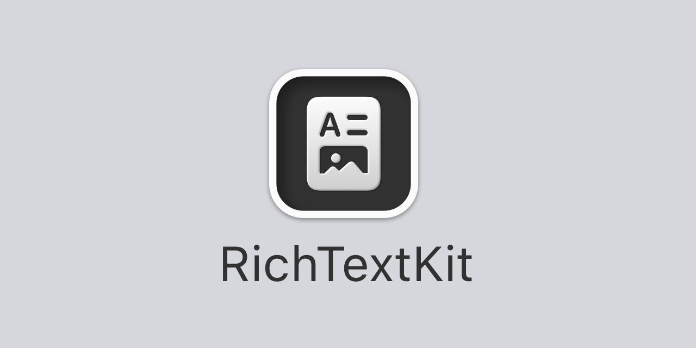

<p align="center">
    
</p>

<p align="center">
    
    
    
    <a href="https://twitter.com/danielsaidi">
        
    </a>
</p>


## About RichTextKit

RichTextKit is a Swift-based library that lets you work with rich text in UIKit, AppKit and SwiftUI.

RIchTextKit supports changing styles (bold, italic, underline), font, font sizes, colors, alignment etc. You can also drag and copy in images if you use a data format that allows it. 

RichTextKit is supported by and released with permission from [Oribi](https://oribi.se/en/) and used in [OribiWriter](https://oribi.se/en/apps/oribi-writer/), which is out on iOS and soon on macOS.


## Supported Platforms

RichTextKit supports `iOS 14`, `macOS 12`, `tvOS 14` and `watchOS 8`.


## Installation

RichTextKit can be installed with the Swift Package Manager:

```
https://github.com/danielsaidi/RichTextKit.git
```

or with CocoaPods:

```
pod RichTextKit
```


## Getting started

To get started with RichTextKit, have a look at [this getting started guide][GettingStarted].


## Documentation

The [online documentation][Documentation] contains more information, code examples etc. and makes it easy to overview the various parts of the library.


## Demo Application

This project contains a demo app that lets you explore RichTextKit on iOS and macOS. To run it, just open and run `Demo/Demo.xcodeproj`.


## Support

You can sponsor this project on [GitHub Sponsors][Sponsors] or get in touch for paid support. 


## Contact

Feel free to reach out if you have questions or if you want to contribute in any way:

* E-mail: [daniel.saidi@gmail.com][Email]
* Twitter: [@danielsaidi][Twitter]
* Web site: [danielsaidi.com][Website]


## License

RichTextKit is available under the MIT license. See the [LICENSE][License] file for more info.


[Email]: mailto:daniel.saidi@gmail.com
[Twitter]: http://www.twitter.com/danielsaidi
[Website]: http://www.danielsaidi.com
[Sponsors]: https://github.com/sponsors/danielsaidi

[Documentation]: https://danielsaidi.github.io/RichTextKit/documentation/richtextkit/
[GettingStarted]: https://github.com/danielsaidi/RichTextKit/blob/master/Readmes/Getting-Started.md
[License]: https://github.com/danielsaidi/RichTextKit/blob/master/LICENSE
