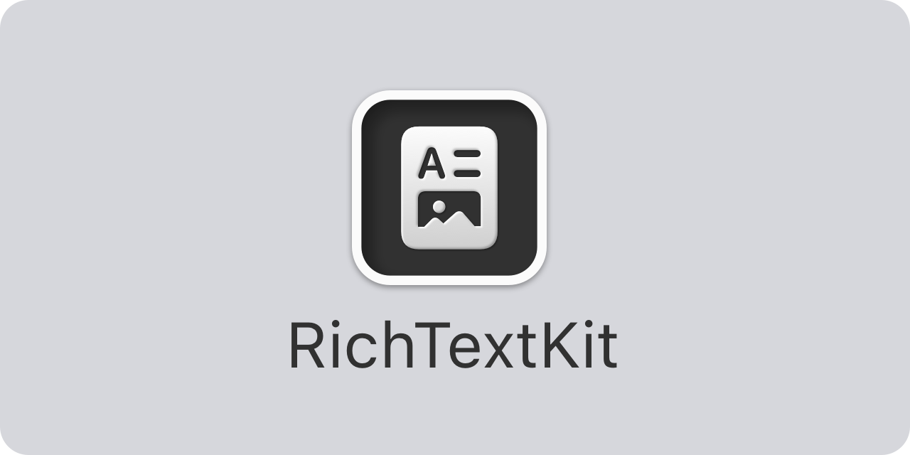

<p align="center">
    
</p>

<p align="center">
    
    
    
    <a href="https://twitter.com/danielsaidi">
        
    </a>
    <a href="https://mastodon.social/@danielsaidi">
        
    </a>
</p>


## About RichTextKit

RichTextKit helps you view and edit rich text in `SwiftUI`, `UIKit` and `AppKit. 

RichTextKit has a SwiftUI `RichTextEditor` that builds on a multi-platform `RichTextView` that supports text style (bold, italic, underline, strikethrough etc.), font, font sizes, text and background colors, text alignment, images etc. 

RichTextKit is supported by and released with permission from [Oribi](https://oribi.se/en/) and used in [OribiWriter](https://oribi.se/en/apps/oribi-writer/), which is available on iOS and macOS. Have a look at that app or the demo app in this repo if you want to see RichTextKit in action.

RichTextKit supports `iOS 14`, `macOS 11`, `tvOS 14` and `watchOS 7`.


## Installation

RichTextKit can be installed with the Swift Package Manager:

```
https://github.com/danielsaidi/RichTextKit.git
```

If you prefer to not have external dependencies, you can also just copy the source code into your app.


## Getting started

The [online documentation][Documentation] has a [getting started][Getting-Started] guide to help you get started with RichTextKit.

RichTextKit has a SwiftUI ``RichTextEditor``, which takes a text binding and a ``RichTextContext``:

```swift
struct MyView: View {

    @State
    private var text = NSAttributedString(string: "Type here...")
    
    @StateObject
    var context = RichTextContext()

    var body: some View {
        RichTextEditor(text: $text, context: context) {
            // You can customize the native text view here
        }
    }
}
```

The editor uses a ``RichTextCoordinator`` to sync changes between the context, the editor and the underlying, platform-specific view. 

You can now use the context to change the text binding and its font, font size, colors, alignment etc. You can also use the context to observe how these properties change, for instance when you move the text input cursor.

For instance, to display and change the current font size, you can use the context's ``RichTextContext/fontSize``:

```swift
Button("Set font size") {
    context.fontSize = 123
}
.onChange(of: context.fontSize) {
    print("The current font size is \(context.fontSize)")
}
```

This means that you can observe and act on any property changes in the context with plain SwiftUI events.

For more information, please see the [online documentation][Documentation] and [getting started guide][Getting-Started].


## Getting started in UIKit and AppKit

In UIKit and AppKit, you can use the underlying ``RichTextView`` directly, instead of a `UITextView` or `NSTextView`:

```swift
RichTextView(data: myData, format: .archivedData)  // Using data
RichTextView(string: myString, format: .plainText) // Using a string
```

`RichTextView` has a lot more functionality than the native views and bridges the platform-specific api:s so that the views behave more alike across platforms. 


## Documentation

The [online documentation][Documentation] has more information, code examples, etc., and lets you overview the various parts of the library.


## Demo Application

The demo app lets you explore the library on iOS and macOS. To try it out, just open and run the `Demo` project.


## Support this library

I manage my various open-source projects in my free time and am really thankful for any help I can get from the community. 

You can sponsor this project on [GitHub Sponsors][Sponsors] or get in touch for paid support.


## Contact

Feel free to reach out if you have questions or if you want to contribute in any way:

* Website: [danielsaidi.com][Website]
* Mastodon: [@danielsaidi@mastodon.social][Mastodon]
* Twitter: [@danielsaidi][Twitter]
* E-mail: [daniel.saidi@gmail.com][Email]


## License

RichTextKit is available under the MIT license. See the [LICENSE][License] file for more info.


[Email]: mailto:daniel.saidi@gmail.com
[Website]: https://www.danielsaidi.com
[Twitter]: https://www.twitter.com/danielsaidi
[Mastodon]: https://mastodon.social/@danielsaidi
[Sponsors]: https://github.com/sponsors/danielsaidi

[Documentation]: https://danielsaidi.github.io/RichTextKit/documentation/richtextkit/
[Getting-Started]: https://danielsaidi.github.io/RichTextKit/documentation/richtextkit/getting-started
[License]: https://github.com/danielsaidi/RichTextKit/blob/master/LICENSE
